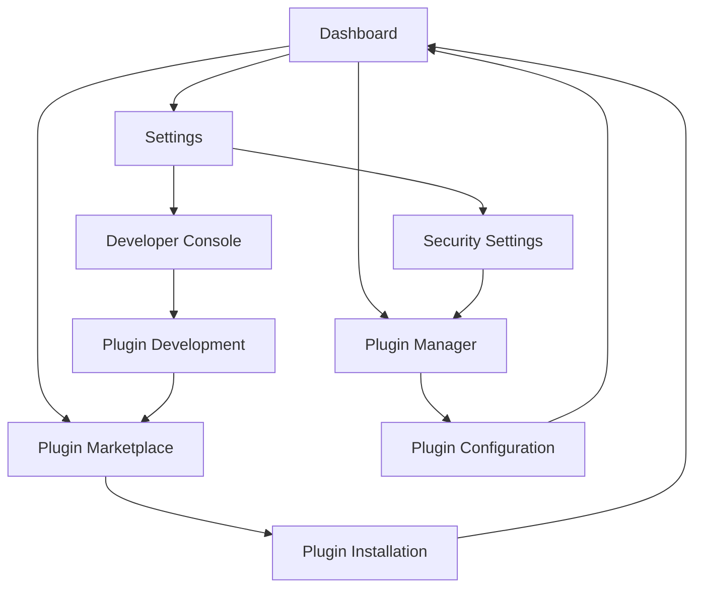

# Electron Super App - Product Requirements Document

## 1. Product Overview

A powerful Electron-based super app that enables users to install, manage, and run mini-applications (plugins) within a unified desktop environment, similar to VS Code's extension system but for general-purpose applications.

The platform solves the problem of application fragmentation by providing a single workspace where users can access multiple specialized tools and utilities. Target users include developers, power users, and organizations seeking a customizable desktop application platform with extensible functionality.

The product aims to create a thriving ecosystem of mini-apps while maintaining security, performance, and user experience standards comparable to modern IDE platforms.

## 2. Core Features

### 2.1 User Roles

| Role | Registration Method | Core Permissions |
|------|---------------------|------------------|
| End User | Local installation | Install/uninstall plugins, manage settings, use installed mini-apps |
| Plugin Developer | Developer registration | Upload plugins, manage plugin versions, access developer tools |
| Administrator | System admin access | Manage user permissions, moderate plugin marketplace, system configuration |

### 2.2 Feature Module

Our Electron Super App consists of the following main pages:

1. **Dashboard**: Main workspace with installed mini-apps grid, quick access toolbar, system status indicators
2. **Plugin Marketplace**: Browse available plugins, search and filter, installation management, ratings and reviews
3. **Plugin Manager**: Installed plugins list, enable/disable controls, plugin settings, update management
4. **Settings**: Application preferences, security settings, developer mode toggle, theme customization
5. **Developer Console**: Plugin development tools, API documentation, debugging interface, plugin testing environment

### 2.3 Page Details

| Page Name | Module Name | Feature description |
|-----------|-------------|---------------------|
| Dashboard | Mini-App Grid | Display installed mini-apps as interactive cards with launch capabilities, recent usage tracking |
| Dashboard | Quick Access Toolbar | Provide shortcuts to frequently used mini-apps and system functions |
| Dashboard | System Status | Show system resource usage, active plugins count, notification center |
| Plugin Marketplace | Plugin Browser | Browse plugins by category, search with filters, view detailed plugin information |
| Plugin Marketplace | Installation Manager | One-click plugin installation, dependency resolution, progress tracking |
| Plugin Marketplace | Rating System | User ratings, reviews, plugin popularity metrics, developer feedback |
| Plugin Manager | Installed Plugins List | View all installed plugins with status indicators, version information |
| Plugin Manager | Plugin Controls | Enable/disable plugins, uninstall, update individual plugins, bulk operations |
| Plugin Manager | Plugin Settings | Configure individual plugin settings, permissions management, data access controls |
| Settings | Application Preferences | Theme selection, language settings, startup behavior, window management |
| Settings | Security Settings | Plugin permission levels, sandboxing options, trusted developer management |
| Settings | Developer Mode | Enable developer tools, plugin debugging, local plugin loading, API access |
| Developer Console | Plugin Development Tools | Code editor integration, plugin scaffolding, build tools, testing framework |
| Developer Console | API Documentation | Interactive API reference, code examples, plugin development guidelines |
| Developer Console | Debug Interface | Plugin runtime monitoring, error logging, performance profiling, network inspection |

## 3. Core Process

**End User Flow:**
1. User launches the super app and lands on Dashboard
2. User browses Plugin Marketplace to discover new mini-apps
3. User installs desired plugins with one-click installation
4. User returns to Dashboard to launch installed mini-apps
5. User manages plugins through Plugin Manager (enable/disable/update)
6. User customizes experience through Settings

**Plugin Developer Flow:**
1. Developer enables Developer Mode in Settings
2. Developer accesses Developer Console for plugin creation
3. Developer uses scaffolding tools to create plugin structure
4. Developer builds and tests plugin locally using debug interface
5. Developer packages plugin for distribution
6. Developer uploads plugin to marketplace for public access

**Administrator Flow:**
1. Administrator accesses system configuration through Settings
2. Administrator reviews and moderates submitted plugins
3. Administrator manages user permissions and security policies
4. Administrator monitors system performance and plugin usage

## 4. User Interface Design

### 4.1 Design Style

- **Primary Colors**: Deep blue (#1890ff) for primary actions, light gray (#f5f5f5) for backgrounds
- **Secondary Colors**: Green (#52c41a) for success states, red (#ff4d4f) for warnings, orange (#fa8c16) for notifications
- **Button Style**: Rounded corners (6px border-radius), subtle shadows, hover animations with color transitions
- **Font**: Inter or system default, 14px base size, 16px for headings, 12px for secondary text
- **Layout Style**: Card-based design with clean spacing, top navigation bar, sidebar for quick access
- **Icons**: Ant Design icons with custom plugin-specific iconography, consistent 16px and 24px sizes

### 4.2 Page Design Overview

| Page Name | Module Name | UI Elements |
|-----------|-------------|-------------|
| Dashboard | Mini-App Grid | Card layout with 4-column responsive grid, hover effects, app icons, launch buttons with primary blue styling |
| Dashboard | Quick Access Toolbar | Horizontal toolbar with icon buttons, tooltips, notification badges, dark theme support |
| Plugin Marketplace | Plugin Browser | List and grid view toggle, search bar with filters, category sidebar, pagination with Ant Design components |
| Plugin Marketplace | Plugin Details | Modal overlay with screenshots, description, ratings display, install button with loading states |
| Plugin Manager | Installed Plugins | Table layout with sortable columns, status indicators, action buttons, bulk selection checkboxes |
| Settings | Preferences Panel | Tabbed interface with form controls, toggle switches, color pickers, preview sections |
| Developer Console | Code Interface | Split-pane layout with file explorer, code editor, terminal output, debugging panels |

### 4.3 Responsiveness

The application is desktop-first with adaptive layouts for different window sizes. Minimum window size of 1024x768, with responsive breakpoints at 1200px and 1600px. Touch interaction optimization is not required as this is a desktop Electron application, but keyboard shortcuts and accessibility features are prioritized for power users.