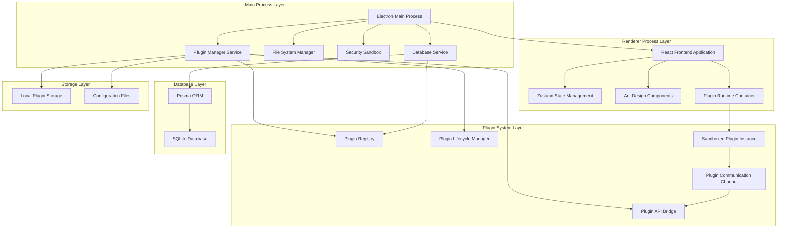
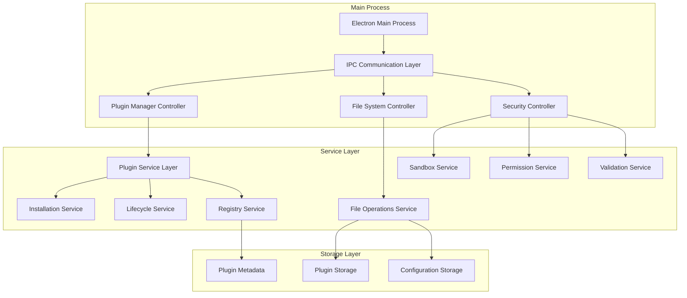
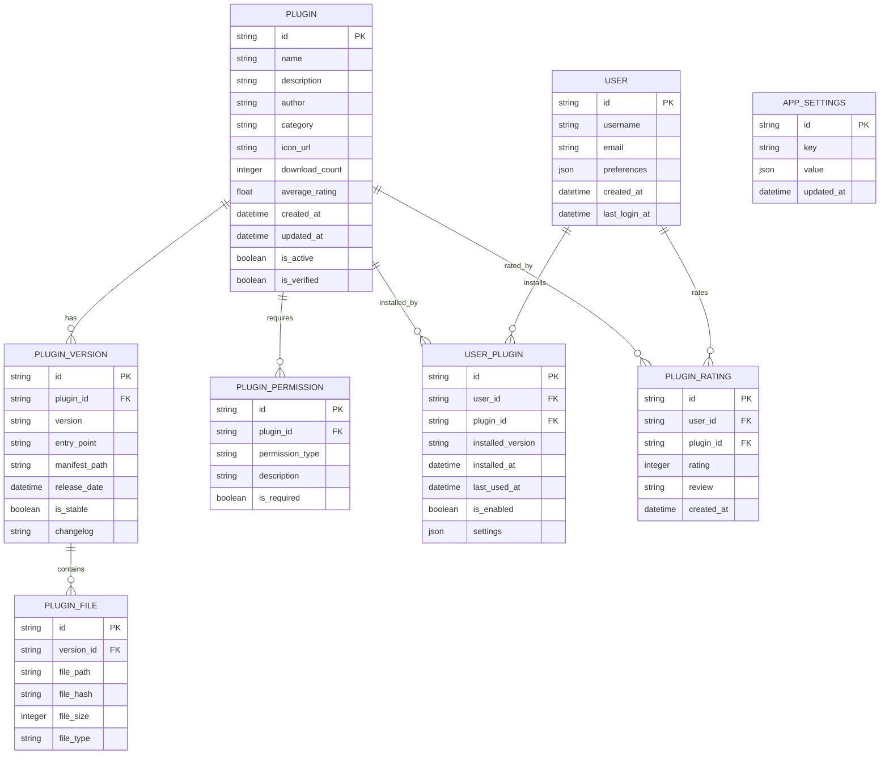

# Electron Super App - Technical Architecture Document

## 1. Architecture Design



## 2. Technology Description

* **Frontend**: React\@19 + TypeScript\@5 + Zustand\@4 + Ant Design\@5 + Vite\@7

* **Desktop Framework**: Electron\@28

* **Database**: Prisma ORM + SQLite (local database for desktop app)

* **Plugin Runtime**: Custom sandboxed iframe with postMessage API

* **State Management**: Zustand for global state, React Context for plugin-specific state

* **Build Tools**: Vite\@7 for frontend bundling with HMR, Electron Builder for packaging

* **Development**: Vite\@7 dev server with hot reload, Prisma migrations and seeding

* **Security**: Content Security Policy, Node.js integration disabled in renderer, contextIsolation enabled

## 3. Route Definitions

| Route        | Purpose                                                                    |
| ------------ | -------------------------------------------------------------------------- |
| /            | Dashboard page, displays installed mini-apps grid and quick access toolbar |
| /marketplace | Plugin marketplace, browse and install available plugins                   |
| /plugins     | Plugin manager, view and manage installed plugins                          |
| /settings    | Application settings, preferences, and configuration                       |
| /developer   | Developer console, plugin development tools and debugging interface        |
| /plugin/:id  | Individual plugin runtime container for executing mini-apps                |

## 4. API Definitions

### 4.1 Core API

**Plugin Management APIs**

```
GET /api/plugins/installed
```

Response:

| Param Name | Param Type | Description                                      |
| ---------- | ---------- | ------------------------------------------------ |
| plugins    | Plugin\[]  | Array of installed plugin metadata from database |
| status     | string     | Response status                                  |

**Plugin Installation**

```
POST /api/plugins/install
```

Request:

| Param Name | Param Type | isRequired | Description                        |
| ---------- | ---------- | ---------- | ---------------------------------- |
| pluginUrl  | string     | true       | URL or path to plugin distribution |
| version    | string     | false      | Specific version to install        |

Response:

| Param Name | Param Type | Description                            |
| ---------- | ---------- | -------------------------------------- |
| success    | boolean    | Installation success status            |
| pluginId   | string     | Unique identifier for installed plugin |

**Plugin Communication Bridge**

```
POST /api/plugins/:id/message
```

Request:

| Param Name | Param Type | isRequired | Description                          |
| ---------- | ---------- | ---------- | ------------------------------------ |
| action     | string     | true       | Action type for plugin communication |
| payload    | object     | false      | Data payload for the action          |

**Database APIs (via Prisma)**

```
GET /api/plugins/marketplace
```

Response:

| Param Name | Param Type           | Description                                        |
| ---------- | -------------------- | -------------------------------------------------- |
| plugins    | MarketplacePlugin\[] | Available plugins with ratings and download counts |
| categories | string\[]            | Available plugin categories                        |

```
POST /api/plugins/:id/rating
```

Request:

| Param Name | Param Type | isRequired | Description          |
| ---------- | ---------- | ---------- | -------------------- |
| rating     | number     | true       | Rating value (1-5)   |
| review     | string     | false      | Optional review text |

```
GET /api/user/settings
```

Response:

| Param Name  | Param Type      | Description                             |
| ----------- | --------------- | --------------------------------------- |
| preferences | UserPreferences | User settings and plugin configurations |

### 4.2 Plugin API Interface

**TypeScript Definitions**

```typescript
interface PluginMetadata {
  id: string;
  name: string;
  version: string;
  description: string;
  author: string;
  permissions: string[];
  entryPoint: string;
  icon?: string;
  category: string;
}

interface PluginAPI {
  // System APIs
  showNotification(message: string, type: 'info' | 'success' | 'warning' | 'error'): void;
  openDialog(options: DialogOptions): Promise<string[]>;
  
  // Storage APIs
  getStorage(key: string): Promise<any>;
  setStorage(key: string, value: any): Promise<void>;
  
  // UI APIs
  createPanel(options: PanelOptions): Panel;
  showModal(component: React.Component): Promise<any>;
  
  // Communication APIs
  sendMessage(targetPlugin: string, message: any): void;
  onMessage(callback: (message: any) => void): void;
}

interface PluginContext {
  metadata: PluginMetadata;
  api: PluginAPI;
  state: any;
}
```

## 5. Server Architecture Diagram



## 6. Data Model

### 6.1 Data Model Definition (Prisma + SQLite)



### 6.2 Data Definition Language (Prisma Schema)

**Prisma Schema (schema.prisma)**

```prisma
// This is your Prisma schema file,
// learn more about it in the docs: https://pris.ly/d/prisma-schema

generator client {
  provider = "prisma-client-js"
}

datasource db {
  provider = "sqlite"
  url      = "file:./dev.db"
}

model Plugin {
  id             String   @id @default(cuid())
  name           String
  description    String
  author         String
  category       String
  iconUrl        String?  @map("icon_url")
  downloadCount  Int      @default(0) @map("download_count")
  averageRating  Float    @default(0) @map("average_rating")
  createdAt      DateTime @default(now()) @map("created_at")
  updatedAt      DateTime @updatedAt @map("updated_at")
  isActive       Boolean  @default(true) @map("is_active")
  isVerified     Boolean  @default(false) @map("is_verified")

  versions    PluginVersion[]
  permissions PluginPermission[]
  userPlugins UserPlugin[]
  ratings     PluginRating[]

  @@map("plugins")
}

model PluginVersion {
  id           String   @id @default(cuid())
  pluginId     String   @map("plugin_id")
  version      String
  entryPoint   String   @map("entry_point")
  manifestPath String   @map("manifest_path")
  releaseDate  DateTime @map("release_date")
  isStable     Boolean  @default(true) @map("is_stable")
  changelog    String?

  plugin Plugin       @relation(fields: [pluginId], references: [id], onDelete: Cascade)
  files  PluginFile[]

  @@map("plugin_versions")
}

model PluginPermission {
  id             String  @id @default(cuid())
  pluginId       String  @map("plugin_id")
  permissionType String  @map("permission_type")
  description    String
  isRequired     Boolean @default(true) @map("is_required")

  plugin Plugin @relation(fields: [pluginId], references: [id], onDelete: Cascade)

  @@map("plugin_permissions")
}

model User {
  id          String    @id @default(cuid())
  username    String    @unique
  email       String    @unique
  preferences Json?
  createdAt   DateTime  @default(now()) @map("created_at")
  lastLoginAt DateTime? @map("last_login_at")

  userPlugins UserPlugin[]
  ratings     PluginRating[]

  @@map("users")
}

model UserPlugin {
  id               String    @id @default(cuid())
  userId           String    @map("user_id")
  pluginId         String    @map("plugin_id")
  installedVersion String    @map("installed_version")
  installedAt      DateTime  @default(now()) @map("installed_at")
  lastUsedAt       DateTime? @map("last_used_at")
  isEnabled        Boolean   @default(true) @map("is_enabled")
  settings         Json?

  user   User   @relation(fields: [userId], references: [id], onDelete: Cascade)
  plugin Plugin @relation(fields: [pluginId], references: [id], onDelete: Cascade)

  @@unique([userId, pluginId])
  @@map("user_plugins")
}

model PluginFile {
  id        String @id @default(cuid())
  versionId String @map("version_id")
  filePath  String @map("file_path")
  fileHash  String @map("file_hash")
  fileSize  Int    @map("file_size")
  fileType  String @map("file_type")

  version PluginVersion @relation(fields: [versionId], references: [id], onDelete: Cascade)

  @@map("plugin_files")
}

model PluginRating {
  id       String   @id @default(cuid())
  userId   String   @map("user_id")
  pluginId String   @map("plugin_id")
  rating   Int // 1-5 stars
  review   String?
  createdAt DateTime @default(now()) @map("created_at")

  user   User   @relation(fields: [userId], references: [id], onDelete: Cascade)
  plugin Plugin @relation(fields: [pluginId], references: [id], onDelete: Cascade)

  @@unique([userId, pluginId])
  @@map("plugin_ratings")
}

model AppSettings {
  id        String   @id @default(cuid())
  key       String   @unique
  value     Json
  updatedAt DateTime @updatedAt @map("updated_at")

  @@map("app_settings")
}
```

**Database Migrations and Seeding**

```sql
-- Initial migration (generated by Prisma)
-- Create tables with proper indexes for performance

CREATE INDEX "idx_plugins_category" ON "plugins"("category");
CREATE INDEX "idx_plugins_author" ON "plugins"("author");
CREATE INDEX "idx_plugins_created_at" ON "plugins"("created_at" DESC);
CREATE INDEX "idx_user_plugins_user_id" ON "user_plugins"("user_id");
CREATE INDEX "idx_user_plugins_plugin_id" ON "user_plugins"("plugin_id");
CREATE INDEX "idx_plugin_ratings_plugin_id" ON "plugin_ratings"("plugin_id");
```

**Seed Data (seed.ts)**

```typescript
import { PrismaClient } from '@prisma/client'

const prisma = new PrismaClient()

async function main() {
  // Create default user
  const defaultUser = await prisma.user.create({
    data: {
      username: 'admin',
      email: 'admin@superapp.local',
      preferences: {
        theme: 'light',
        language: 'en',
        autoUpdate: true,
        developerMode: false
      }
    }
  })

  // Create sample plugins
  const calculatorPlugin = await prisma.plugin.create({
    data: {
      name: 'Calculator',
      description: 'Simple calculator mini-app',
      author: 'Super App Team',
      category: 'utilities',
      iconUrl: 'assets/calculator-icon.png',
      downloadCount: 150,
      averageRating: 4.5,
      isVerified: true,
      versions: {
        create: {
          version: '1.0.0',
          entryPoint: 'dist/index.html',
          manifestPath: 'manifest.json',
          releaseDate: new Date(),
          changelog: 'Initial release'
        }
      },
      permissions: {
        create: [
          {
            permissionType: 'storage',
            description: 'Store calculation history'
          },
          {
            permissionType: 'notifications',
            description: 'Show calculation results'
          }
        ]
      }
    }
  })

  // Create default app settings
  await prisma.appSettings.createMany({
    data: [
      {
        key: 'security.allowUntrustedPlugins',
        value: false
      },
      {
        key: 'security.sandboxLevel',
        value: 'strict'
      },
      {
        key: 'ui.theme',
        value: 'light'
      }
    ]
  })

  console.log('Database seeded successfully!')
}

main()
  .catch((e) => {
    console.error(e)
    process.exit(1)
  })
  .finally(async () => {
    await prisma.$disconnect()
  })
```

**File System Structure (Updated)**

```
/app-data/
├── database/
│   └── dev.db (SQLite database)
├── plugins/
│   ├── com.example.calculator/
│   │   ├── dist/
│   │   ├── assets/
│   │   └── manifest.json
│   └── com.example.notepad/
├── config/
│   └── security-policies.json
└── logs/
    ├── plugin-manager.log
    ├── database.log
    └── security.log
```

**Development Commands**

```bash
# Database setup
npx prisma generate          # Generate Prisma client
npx prisma db push          # Push schema to database
npx prisma db seed          # Seed initial data
npx prisma studio           # Open database browser

# Development with Vite 7
npm run dev                 # Start Vite dev server with HMR
npm run build               # Build for production
npm run preview             # Preview production build
npm run electron:dev        # Start Electron in development mode
npm run electron:build      # Build Electron app for distribution
```

