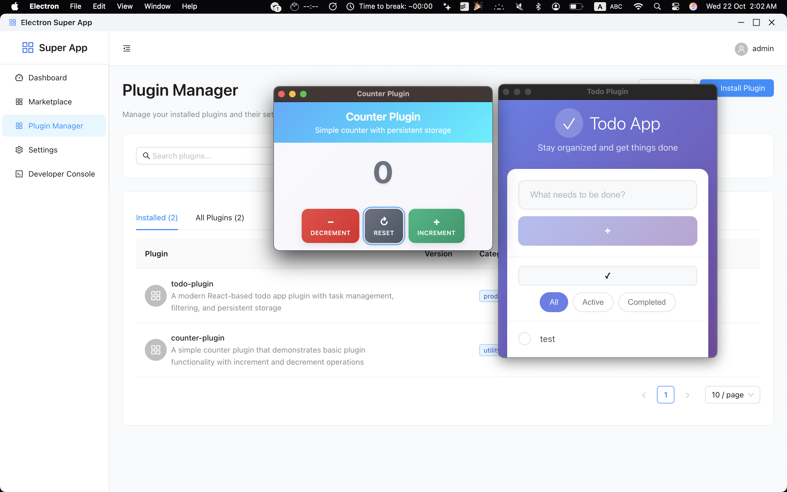

# Electron Super App

> Universal super app (Web + Electron) with plugin architecture and integrated Conda for effortless AI development.

A modern, extensible desktop application built with Electron and React that provides a plugin-based ecosystem for running mini-applications. Designed with AI development in mind, featuring a secure sandbox environment and comprehensive plugin management system.

## ⚠️ Package Manager Requirement

**This project requires pnpm as the package manager.** Using npm or yarn will result in errors.

### Quick Setup

```bash
# Install pnpm globally
npm install -g pnpm

# Run the setup script
./scripts/setup.sh    # Linux/macOS
# or
scripts/setup.bat     # Windows

# Or manually install dependencies
pnpm install
```


_Plugin Manager interface showing Counter Plugin and Todo Plugin running in sandboxed windows_

## 🚀 Features

### Core Platform

- **Cross-Platform Desktop App** - Built with Electron for Windows, macOS, and Linux
- **Modern Web Technologies** - React 19, TypeScript, Vite, and Ant Design
- **Dual Runtime** - Works as both web application and desktop app
- **Dark/Light Theme** - Comprehensive theming system with user preferences
- **🆕 Pinokio Terminal API** - Integrated auto-start daemon with optimized REST API (5-10x faster!)

### Pinokio Terminal Integration (NEW!)

- **Git Submodule Integration** - Pinokio daemon as separate submodule, auto-installs on setup
- **Optimized Performance** - Direct HTTP calls, 140x faster version checks, 10x faster operations
- **REST API** - Complete API for clipboard, notifications, scripts, and more
- **Full Test Coverage** - 15 comprehensive tests, all passing
- **No npx Overhead** - Uses local executable and direct HTTP for maximum speed
- **Easy Development** - One command starts both daemon and API with `npm run dev:all`

### Plugin Architecture

- **Secure Sandbox Environment** - Isolated plugin execution with controlled permissions
- **Plugin Manager** - Install, manage, and configure plugins with ease
- **Developer Console** - Built-in debugging and development tools
- **Plugin Marketplace** - Discover and install community plugins
- **Hot Reload** - Development-friendly plugin loading and testing

### Security & Permissions

- **Permission-Based Access** - Granular control over plugin capabilities
- **Content Security Policy** - Strict security policies for plugin isolation
- **Sandboxed Execution** - Plugins run in isolated environments
- **Verified Plugins** - Plugin verification and trust system

### Data Management

- **SQLite Database** - Local data storage with Prisma ORM
- **User Management** - Multi-user support with preferences
- **Plugin Storage API** - Persistent storage for plugin data
- **Settings Management** - Centralized configuration system

## 🏗️ Architecture

```
┌─────────────────────────────────────────────────────────────┐
│                    Electron Main Process                    │
├─────────────────────────────────────────────────────────────┤
│  Plugin Manager  │  Security Manager  │  Database Service  │
├─────────────────────────────────────────────────────────────┤
│                    React Frontend App                       │
│  Dashboard  │  Marketplace  │  Plugin Manager  │  Settings  │
├─────────────────────────────────────────────────────────────┤
│                    Plugin Sandbox Layer                     │
│         Isolated Plugin Instances with Controlled API       │
├─────────────────────────────────────────────────────────────┤
│                    Data & Storage Layer                     │
│           Prisma ORM + SQLite + Plugin Storage             │
└─────────────────────────────────────────────────────────────┘
```

## 🛠️ Technology Stack

### Frontend

- **React 19** - Modern React with hooks and concurrent features
- **TypeScript 5** - Type-safe development
- **Vite 7** - Fast build tool and development server
- **Ant Design 5** - Professional UI component library
- **Zustand** - Lightweight state management
- **React Router** - Client-side routing

### Backend & Desktop

- **Electron 38** - Cross-platform desktop framework
- **Node.js** - Server-side JavaScript runtime
- **Express** - Web application framework
- **Prisma** - Modern database toolkit and ORM
- **SQLite** - Embedded database

### Development & Build

- **Electron-Vite v5** - Modern build tool for Electron with HMR support
- **Electron Builder** - Application packaging
- **Vitest** - Unit testing framework
- **ESLint** - Code linting and formatting
- **Tailwind CSS** - Utility-first CSS framework

## 📦 Installation

### Prerequisites

- Node.js 18+
- npm or yarn
- Git

### Development Setup

1. **Clone the repository**

   ```bash
   git clone <repository-url>
   cd electron-conda
   ```

2. **Install dependencies**

   ```bash
   npm install
   ```

3. **Set up the database**

   ```bash
   npm run db:generate
   npm run db:push
   npm run db:seed
   ```

4. **Start development server**

   ```bash
   npm run dev
   ```

The application will start with:

- Main app running on `http://localhost:5174`
- Electron desktop app launching automatically
- Hot reload enabled for development

## 🎯 Usage

### Running the Application

**Development Mode:**

```bash
npm run dev          # Start electron app with hot reload
npm run server:dev   # Start API server only
npm run dev:all      # Start both API server and electron app
```

**Production Build:**

```bash
npm run build        # Build for production
npm run electron:build # Build electron app
```

**Database Operations:**

```bash
npm run db:studio    # Open Prisma Studio
npm run db:seed      # Seed database with sample data
```

### Plugin Development

1. **Create a new plugin directory** in `/apps/`
2. **Add a `package.json`** with plugin manifest
3. **Develop your plugin** using HTML, CSS, and JavaScript
4. **Use the Plugin API** for storage, notifications, and more
5. **Test with hot reload** using the development mode

#### Development Mode Features

- **Hot Reload**: Automatic plugin reloading on file changes
- **Real-time Communication**: Message passing between plugins and main app
- **Development Tools**: Built-in testing utilities and performance monitoring
- **Debug Console**: Enhanced logging and debugging capabilities

#### Quick Start for Plugin Development

```bash
# Start the main Electron app
npm run dev

# Start the development plugin server (counter-app-dev example)
npm run counter-app-dev
```

The counter-app-dev plugin demonstrates all development features including hot reload, real-time communication, and testing utilities.

See [Plugin Development Guide](docs/PLUGIN_DEVELOPMENT_GUIDE.md) for detailed information.

Example plugin structure:

```
apps/my-plugin/
├── package.json     # Plugin manifest
├── index.html       # Entry point
├── script.js        # Plugin logic
├── styles.css       # Plugin styles
├── vite.config.js   # Development server config
└── README.md        # Plugin documentation
```

## 🔌 Plugin System

### Available APIs

- **Storage API** - Persistent key-value storage
- **Notifications API** - System notifications
- **Network API** - HTTP requests (with permissions)
- **Filesystem API** - Limited file operations
- **Window API** - Window management and configuration

### Sample Plugins Included

- **Counter Plugin** - Simple counter with persistent storage
- **Todo Plugin** - Task management with React and modern UI

### Plugin Permissions

```json
{
  "permissions": [
    "storage", // Access to plugin storage
    "notifications", // Show system notifications
    "network", // Make HTTP requests
    "filesystem" // Limited file system access
  ]
}
```

## 🧪 Testing

```bash
npm test              # Run all tests
npm run test:ui       # Run tests with UI
npm run test:unit     # Run unit tests only
npm run test:integration # Run integration tests
```

## 📚 Documentation

Comprehensive documentation is available in the `.trae/documents/` directory:

- **[Technical Architecture](/.trae/documents/electron-super-app-technical-architecture.md)** - System design and architecture
- **[Plugin Development Guide](/.trae/documents/plugin-development-guide.md)** - Complete plugin development reference
- **[Plugin API Reference](/.trae/documents/plugin-api-reference.md)** - API documentation
- **[Plugin Examples](/.trae/documents/plugin-examples-templates.md)** - Sample plugins and templates

## 🤝 Contributing

1. Fork the repository
2. Create a feature branch (`git checkout -b feature/amazing-feature`)
3. Commit your changes (`git commit -m 'Add amazing feature'`)
4. Push to the branch (`git push origin feature/amazing-feature`)
5. Open a Pull Request

## 📄 License

This project is licensed under the MIT License - see the [LICENSE](LICENSE) file for details.

## 🔮 Roadmap

- [ ] **Conda Integration** - Seamless Python environment management
- [ ] **AI/ML Plugin Templates** - Pre-built templates for AI development
- [ ] **Plugin Store** - Online marketplace for plugin distribution
- [ ] **Cloud Sync** - Synchronize plugins and data across devices
- [ ] **Plugin Analytics** - Usage analytics and performance monitoring
- [ ] **Advanced Security** - Enhanced plugin sandboxing and verification

## 🆘 Support

- **Documentation** - Check the `/docs` directory
- **Issues** - Report bugs and request features via GitHub Issues
- **Developer Console** - Use the built-in debugging tools
- **Community** - Join our community discussions

---

**Built with ❤️ for the developer community**
